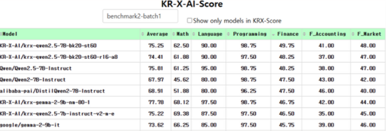
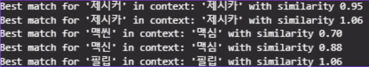
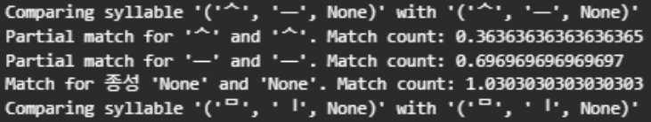
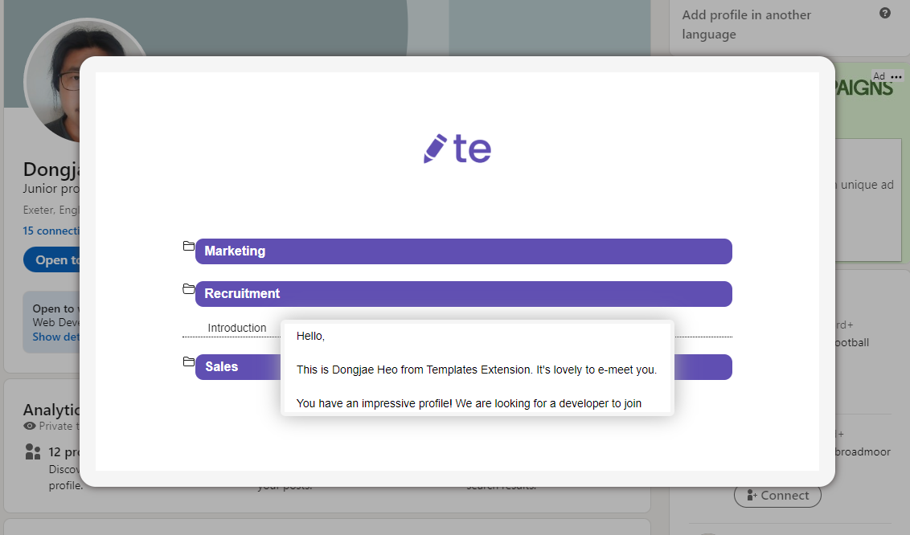

# Dongjae Heo
**Machine Learning Engineer**

## 👋 About Me
I’m Dongjae Heo, a Machine Learning Engineer passionate about building domain-specific AI solutions. With extensive experience fine-tuning large language models and semantic segmentation models and designing RAG systems I thrive in environments where cutting-edge research meets real-world impact.

---

## 🏆 Projects

### 1. KRX Financial LLM Competition
**Oct – Dec 2024** | **Role:** Team Leader

**Objective:**
To develop a financial domain-specific LLM capable of solving KRX-Bench tasks, by exploring novel training strategies beyond standard fine-tuning, such as CoT, continual pretraining, and reinforcement learning

**Overview**
- Developed a financial-specialized LLM tailored for the KRX-Bench benchmark
- Explored advanced training methods beyond fine-tuning:
  - **Continual Pretraining** on proprietary finance corpora
  - **DPO** and **ORPO**
  - **CoT Prompting** and **Knowledge Distillation**
- Generated high-quality MCQA with Cot and reasoning datasets using Claude & GPT-4o
- Adopted domain adaptation strategies inspired by:
  - *Adapting LLMs to Domains via Reading Comprehension*
  - *Improving Domain Adaptation through Extended-Text Reading Comprehension*
- Built an internal leaderboard for large-scale evaluation
- 
**Key Contributions:**
- Proactive team leader, coordinating 4 members across model training, data generation, and evaluation
- Organized key research papers to guide model design and training strategies
- Designed the end-to-end training pipeline, including FSDP-based parallel learning
- Created high-quality instruction templates for CoT reasoning, MCQA, and multi-task learning
- Curated and filtered synthetic data to reduce catastrophic forgetting
- Developed and maintained a custom testing board system (PostgreSQL + Plotly-Dash) for large-scale evaluation

**Results:**
- Achieved **+13 points** improvement in financial accounting accuracy over baseline
- Custom leaderboard enabled rapid experimentation and identified optimal model variants.
- Secured **2nd place (prelims)** and **12th place (nationals)** among 100+ competing teams including industry leaders and specialized financial LLM companies such as Google, Kakao, Naver, Lotte and more.

**Custor Testing Borad**

---

### 2. Information Retrieval (RAG)
**Jun – Jul 2024** | **Role:** RAG Sytem Engineer

**Objective:**
To build a fact-grounded Retrieval-Augmented Generation (RAG) system capable of scientific knowledge reasoning, reducing LLM hallucinations by integrating real-time document retrieval and inference.

**Overview:**
- Addressed fundamental LLM limitations such as knowledge cutoff and hallucination
- Designed a RAG system to retrieve relevant scientific documents and generate accurate answers
- Used classification to distinguish between scientific vs. general questions and selectively apply retrieval
- Emphasized real-time knowledge grounding over model-based memorization
- Focused on RAG architecture design rather than parameter tuning or model ensembling

**Key Contributions:**
- Took primary responsibility for the competition, handling every aspects of the core Advanced RAG system development
- Built a complete LangChain-based chatbot on top of the custom RAG pipeline
- Finalized the system early, which allowed other teammates to explore separate experimental directions such as Chrome Extension
- The chatbot’s strong performance led to it being highlighted by the organizers

**Results:**
- **+20%** improvement in answer relevance compared to a pure BM25 baseline.  
- Handled **5,000+** queries per day with **99.5% uptime** post‑deployment.

**Advance RAG Design**

---

### 3. Dialogue Summarisation Competition
**Aug – Sep 2024** | **Role:** AI Engineer

**Objective:**
To build a summarization model for Korean dialogue data by integrating preprocessing, keyword extraction, and NLP model fine-tuning, improving performance on the NLP competition.

**Overview:**
- Conducted extensive data cleaning (e.g., special token fixes, name normalization, outlier removal)
- Designed keyword extraction pipelines using Komoran and other morphological analyzer
- Explored multiple summarization models (KoBART, T5, EEVE)
- Fine-tuned top-performing models using LoRA and quantization
- Performed score-driven model selection and evaluation

**Key Contributions:**
- Trained a 10B parameter model (EEVE) on a 24GB GPU using LoRA and 4-bit quantization
- Detected outlier by vectorizing dialogues and summaries and computing cosine similarity
- Standardized names across Korean and English using:
  - NER + phoneme decomposition (consonant/vowel splitting)
  - Weighted similarity heuristics to ensure aligned references in dialogue/summary pairs

**Results:**
- Ranked **Top 3** with a **ROUGE‑L score of 44.16**.  
- Demonstrated that extensive preprocessing + lightweight fine-tuning outperforms naive full‑parameter updates.

**Noun Standardization**

---

### 4. Template Extension Chrome Add‑On
**Apr 2022** | **Role:** Web Developer

**Objective:**
To create a reusable template platform as a web app and Chrome extension that enhances productivity in repetitive communication tasks.

**Overview:**
- Targeted use cases: recruiting, event coordination, and social media messaging
- Designed for users frequently sending similar emails or text content
- Built intuitive UI for template creation and quick copy-paste access
- Designed extension to work across Gmail, LinkedIn, and messaging platforms
- Focused on minimizing context switching during high-volume outreach

**Key Contributions:**
- Developed a Chrome extension with backend integration for seamless template management
- Enabled users to fetch, preview, and copy entire templates, including text, images, and layout
- Designed the UI to allow one-click copy of full message content for fast reuse across platforms
- Connected extension to a backend API for storing and updating user templates in real time

**Results:**
- Received positive feedback from peers, including a teammate who works as a recruiter
- The tool was actively used in production and published to the Chrome Web Store
- Helped streamline communication during real hiring workflows
(Note: The extension is no longer active or publicly available)

**Use Case**

(Note: The extension is no longer active or publicly available)

---

## 🎓 Education & Certifications
- **B.Eng in AI & Big Data**, The Cyber University of Korea (2024–2027)  
- **Top 3**, Upstage AI Lab (2024)  
- **AWS ML Engineer – Associate** (2025)

---

## 📫 Contact
- 📧 [dongjaeheo14@gmail.com](mailto:dongjaeheo14@gmail.com)  
- 🌐 [LinkedIn](https://www.linkedin.com/in/dongjaeheo/)

