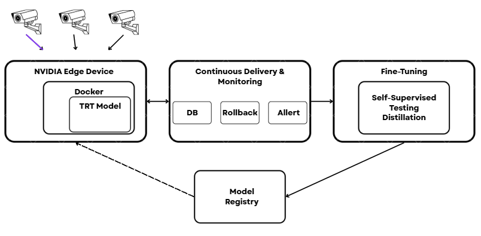
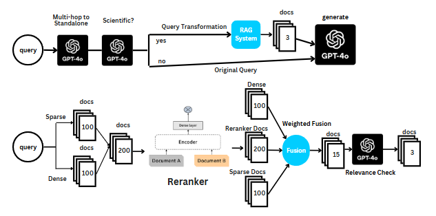

# **Dongjae Heo — Machine Learning Engineer**  
**LLMs • RAG Systems • Computer Vision • Edge AI Deployment**

I build **real, deployed AI systems**—from **LLMs and RAG architectures** to **CV models on edge devices**.  
My work spans national research institutes, commercial deployments, and competitive AI engineering.  
I focus on **robustness, reproducibility, and production-grade reliability** rather than demos.

**Applied ML engineer with 2+ years of experience building RAG systems, training/evaluating LLMs, and deploying computer vision models on edge AI hardware.**

---

## 🔍 **What I Work On**

- Deploying CV models on edge hardware (Jetson, TensorRT, Docker) for safety-critical use cases.  
- Building evaluation, monitoring, and benchmarking pipelines for deepfake detection and VLM systems.  
- Researching **heterogeneous Federated Learning**, focusing on non-IID data, imbalance, client heterogeneity, privacy constraints, and personalisation-aware optimisation for real-world systems.

---

## 🧰 **Core Skills**

- **MLOps & Deployment:** Docker, TensorRT, ONNX, GStreamer, FastAPI, monitoring, rollback, edge optimisation.  
- **ML / DL:** LLMs, RAG, multimodal detection, zero-shot detection, segmentation, distillation, CoT, continual pretraining.  
- **Data Pipelines:** pseudo-labelling, annotation/QC, dataset curation, large-scale evaluation systems.  
- **Frameworks:** PyTorch, Hugging Face, LangChain, Lightning/FSDP.  
- **Cloud / Infra:** AWS (EC2, S3, ECR, Lambda), CI/CD, Linux.  
- **Languages:** Python, SQL.  

---

# 🚀 **Highlighted Work**

## **1. Multimodal Deepfake & Manipulation Detection (ETRI — National Research Project)**  
**AI Research Engineer (2025)**  
**Repo:** *Private due to NDA (technical design and methodology can be discussed in interview)*

Worked with **ETRI**, Korea’s national AI and telecommunications research institute  
(*similar in role to the UK’s Alan Turing Institute*),  
on a multimodal deepfake detection programme covering image, video, and text-conditioned manipulations.

Focused on building a **unified evaluation pipeline** for both CV-based detectors and VLM-based zero-shot systems.

**Key Contributions:**  
- Designed a **unified, research-grade benchmarking framework** capable of evaluating **binary deepfake detectors**, **multimodal/VLM-based zero-shot detectors**, and **explanation modules** within a single pipeline.  
- Built dataset conversion pipelines and metadata standards to unify **heterogeneous deepfake datasets** into a consistent structure.  
- Developed **Hydra-based CLI tools**, reproducible Docker environments, and training/inference workflows supporting **multi-GPU execution (e.g. DDP)**.  
- Implemented smoke/full evaluation modes, GPU-memory profiling tools, and systematic failure-mode analysis.  
- Created automated cross-model and cross-dataset comparison pipelines for large-scale, reproducible experimentation.  

**Impact:**  
- Delivered a standardised, scalable benchmarking framework to **ETRI**.  
- Significantly reduced evaluation time and enabled rapid model comparison.  
- Provided core infrastructure for ongoing national multimodal forgery analysis.  

---

## **2. Safety-Critical Semantic Segmentation (NIPA — Commercial Deployment)**  
**AI Research Engineer (2025)**  
**Repo:** *Private due to NDA (technical design and methodology can be discussed in interview)*

Developed a **production-grade semantic segmentation system (SegFormer + TensorRT)** for safety-critical industrial environments under a national commercial project funded by **NIPA**.

The system included a GStreamer-based pipeline, self-supervised retraining loop, and Dockerised deployment across NVIDIA Jetson devices.

**Key Contributions:**  
- Built the full inference pipeline: **multi-camera ingestion → GStreamer preprocessing → TensorRT engine → Dockerised edge deployment**.  
- Designed a **self-supervised retraining loop** (log extraction → pseudo-labels → distillation → automated redeploy).  
- Established dataset and annotation standards with QC pipelines.  
- Integrated robust monitoring, alerting, and **safe rollback** mechanisms for production stability.  
- Oversaw **installation and on-site deployment** on NVIDIA Jetson edge hardware.  
- Optimised performance to maintain **near-identical inference speed and reliability** when moving from **Jetson AGX** to significantly older **Jetson Nano** hardware.  

**Impact:**  
- Achieved ~80% IoU on segmentation and **99% recall**, the critical metric for downstream obstruction detection.  
- Delivered a production-ready system running in real industrial environments.  
- Built an upgradeable pipeline enabling continuous iteration and safe deployments.  

---

## **3. Zero-Shot Object Detection Research (Dromii / Seoul AI Hub)**  
**AI Research Engineer (2025)**  
**Repo:** https://github.com/DongjaeHeo/zero-shot-vlm

Conducted applied research on zero-shot detection using VLMs for safety and industrial inspection.

**Highlights:**  
- Developed baseline zero-shot detection pipelines and reproducible experiment frameworks.  
- Designed evaluation metrics, logging systems, and visualisation tools.  
- Explored embedding alignment, prompt engineering, and non-standard research approaches.  
- Authored *“A Study on the Application of Vision-Language Models for Zero-Shot Obstruction Detection in Drone Imagery”*.  
- Provided technical mentorship to startup engineers.  

---

## **4. Financial Domain LLM (KRX — National Financial LLM Competition)**  
**Team Lead / ML Engineer (2024)**  
**Repo:** *Private due to competition rules*

Led a **four-person team** to develop a **financial-domain LLM** using continual pretraining, DPO/ORPO, CoT prompting, and synthetic data generation.

**My Role:**  
- Designed the full training workflow (FSDP + synthetic data loop).  
- Built a PostgreSQL + Plotly Dash **evaluation board** for large-scale model comparison.  
- Curated reasoning datasets while mitigating catastrophic forgetting.  
- Coordinated experimentation, papers, and team direction.  

**Results:**  
- **+13-point improvement** vs. baseline on accounting tasks.  
- **2nd place (prelims)** and **12th place (finals)** among 100+ teams (Google, Naver, Kakao, Lotte participated).  

---

## **5. Retrieval-Augmented Generation System (Competition)**  
**RAG System Engineer (2024)**  
**Repo:** https://github.com/DongjaeHeo/upstage-ai-advanced-ir7

Built an advanced **RAG system for scientific QA**, focusing on selective retrieval, routing, and hallucination reduction.

**Contributions:**  
- Implemented the full RAG pipeline: retriever + reranker + LLM.  
- Built a LangChain chatbot with memory, query transformation, and routing logic.  
- Delivered early, enabling teammates to extend features.  

**Results:**  
- **+30% retrieval accuracy** over a naive RAG baseline.  
- **1st place (Public)** and **2nd place (Private)**.  

---

## **6. Korean Dialogue Summarisation System**  
**AI Engineer (2024)**  
**Repo:** https://github.com/DongjaeHeo/upstage-dialogue-summarization-competition

Trained a 10B-parameter summarisation model with LoRA + 4-bit quantisation.

**Highlights:**  
- Built Korean name-standardisation via phoneme decomposition + weighted heuristics.  
- Removed outliers using cosine-similarity filtering.  
- Explored KoBART, T5, and EEVE variants.  

**Results:**  
- **Top 3 overall**, **ROUGE-L 44.16**.  

---

## **7. Chrome Productivity Extension (Templates Platform)**  
**Web Developer (2022)**  
**Repo:** https://github.com/EloPividori/Templates-Chrome-Extension

Chrome extension + backend API for managing reusable message templates across Gmail, LinkedIn, and other platforms.

---

## 🎓 **Education & Certifications**

- **AI & Big Data (B.Eng.)** — The Cyber University of Korea  
  *Highest Honor Scholarship, 3 consecutive semesters.*  
- **Top 3 — Upstage AI Lab (2024)**  
- **AWS ML Engineer – Associate (2025)**  
- **AWS Solutions Architect – Associate (2024)**  

---

## 📞 **Contact**

- **Email:** dongjaeheo14@gmail.com  
- **Phone (UK):** +44 7878 316264  
- **LinkedIn:** https://linkedin.com/in/dongjaeheo  
