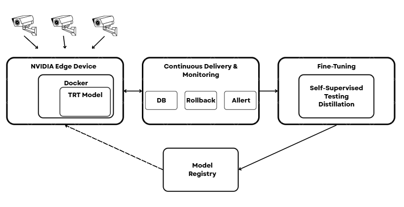

# **Dongjae Heo — Machine Learning Engineer**  
**LLMs • RAG Systems • Computer Vision • Edge AI Deployment**

I build **real, deployed AI systems**—from **LLMs and RAG architectures** to **CV models on edge devices**.  
My work spans national research institutes, commercial deployments, and competitive AI engineering.  
I focus on **robustness, reproducibility, and production-grade reliability** rather than demos.

🔍 **Open to ML/AI Engineer roles (UK-based or remote).**

---

## 🧰 **Core Skills**

- **ML / DL:** LLMs, RAG, multimodal detection, zero-shot detection, segmentation, distillation, CoT, continual pretraining  
- **MLOps & Deployment:** Docker, TensorRT, ONNX, GStreamer, FastAPI, monitoring, rollback, edge optimisation  
- **Data Pipelines:** pseudo-labeling, annotation/QC, dataset curation, large-scale evaluation systems  
- **Frameworks:** PyTorch, Hugging Face, LangChain, Lightning/FSDP  
- **Cloud / Infra:** AWS (EC2, S3, ECR, Lambda), CI/CD, Linux  
- **Languages:** Python, JavaScript (Chrome extensions), SQL  

---

# 🚀 **Highlighted Work**

## **1. Multimodal Deepfake & Manipulation Detection (ETRI — National Research Project)**  
**AI Research Engineer (2024–2025)**  
**Repo:** *Private due to NDA*

Worked with **ETRI**, Korea’s national AI and telecommunications research institute  
(*similar in role to the UK’s Alan Turing Institute*)  
on a multimodal deepfake detection programme covering image, video, and text-conditioned manipulations.

Focused on building a **unified evaluation pipeline** for both CV-based detectors and VLM-based zero-shot systems.

**Key Contributions:**  
- Designed a **unified, research-grade benchmarking framework** capable of evaluating **binary deepfake detectors**, **multimodal/VLM-based zero-shot detectors**, and **explanation modules** within a single pipeline  
- Built dataset conversion pipelines and metadata standards to unify **heterogeneous deepfake datasets** into a consistent structure  
- Developed **Hydra-based CLI tools**, reproducible Docker environments, and training/inference workflows supporting **multi-GPU execution (e.g., DDP)**  
- Implemented smoke/full evaluation modes, GPU-memory profiling tools, and systematic failure-mode analysis  
- Created automated cross-model and cross-dataset comparison pipelines for large-scale, reproducible experimentation  

**Impact:**  
- Delivered a framework used by **ETRI** for national deepfake research  
- Significantly reduced evaluation time and enabled rapid model comparison  
- Provided core infrastructure for ongoing multimodal forgery analysis across institutions

---

## **2. Safety-Critical Semantic Segmentation (NIPA — Commercial Deployment)**  
**AI Research Engineer (2025)**  
**Repo:** *Private due to NDA*

Developed a **SegFormer-based semantic segmentation system** for safety-critical industrial environments under a national commercial project funded by **NIPA (Korea’s IT Industry Promotion Agency)**.

**Key Contributions:**  
- Built the full inference pipeline: **multi-camera ingestion → GStreamer preprocessing → TensorRT engine → Dockerised edge deployment**  
- Designed a **self-supervised retraining loop** (log extraction → pseudo-labels → distillation → automated redeploy)  
- Established dataset and annotation standards with QC pipelines  
- Integrated robust monitoring, alerting, and **safe rollback** mechanisms for production stability  
- Oversaw the **installation and deployment process** on on-site **NVIDIA Jetson edge devices**  
- Optimised performance to maintain **near-identical inference speed and reliability** when transitioning from **Jetson AGX** to significantly older **Jetson Nano** hardware  

**Impact:**  
- Achieved ~80% IoU on segmentation and **99% recall** on the downstream obstruction-detection task.
- Delivered a production-ready system deployed in real field environments  
- Built an upgradeable pipeline enabling continuous iteration and safe deployments  

---

## **3. Zero-Shot Object Detection Research (Dromii / Seoul AI Hub)**  
**AI Research Engineer (2025)**  
**Repo:** https://github.com/DongjaeHeo/zero_shot_vlm

Conducted applied research on zero-shot detection using VLMs for safety inspection and industrial settings.

**Highlights:**  
- Developed baseline zero-shot detection pipelines and reproducible experiment frameworks  
- Designed evaluation metrics, logging systems, and visualization tools  
- Explored embedding alignment, prompt engineering, and non-standard research techniques  
- Authored a **A Study on the Application of Vision-Language Models for Zero-Shot Obstruction Detection in Drone Imagery**, demonstrating performance gains in industrial scenarios  
- Provided technical guidance and research mentorship to startup engineers  

---

## **4. Financial Domain LLM (KRX Competition — Team Leader)**  
**2024 National Financial LLM Competition**  
**Repo:** *Private (competition rules)*

Led a 4-person team to develop a **financial-specialised LLM** using continual pretraining, DPO/ORPO, CoT prompting, and synthetic data generation.

**My Role:**  
- Designed the end-to-end training pipeline (FSDP training + synthetic data loop)  
- Built a PostgreSQL + Plotly Dash **evaluation board** for large-scale model comparison  
- Curated reasoning datasets with filtering to reduce catastrophic forgetting  
- Coordinated roles, papers, and experimentation strategy  

**Results:**  
- **+13-point gain** over baseline on accounting tasks  
- **2nd place (prelims)** and **12th place (finals)** among 100+ teams (Google/Naver/Kakao/Lotte participated)  

---

## **5. Retrieval-Augmented Generation System (Competition)**  
**RAG System Engineer (2024)**  
**Repo:** https://github.com/DongjaeHeo/upstage-ai-advanced-ir7

Built an **Advanced RAG system for scientific QA** with selective retrieval, routing, and hallucination reduction.

**Contributions:**  
- Implemented full RAG pipeline: retriever + reranker + LLM integration  
- Built LangChain-based chatbot with memory, query transformation, and routing logic  
- Delivered early, allowing teammates to extend features  

**Results:**  
- **+30% retrieval accuracy** over naive baseline  
- **1st place (Public)** and **2nd place (Private)**  

---

## **6. Korean Dialogue Summarisation System**  
**AI Engineer (2024)**  
**Repo:** https://github.com/DongjaeHeo/upstage-dialogue-summarization-competition

Trained a 10B-parameter summarisation model with LoRA + 4-bit quantization and aggressive data normalization.

**Highlights:**  
- Built custom Korean name-standardisation using phoneme decomposition + weighted heuristics  
- Removed outliers via cosine-similarity scoring  
- Explored KoBART, T5, and EEVE variants  

**Results:**  
- **Top 3 overall**, **ROUGE-L 44.16**  

---

## **7. Chrome Productivity Extension (Templates Platform)**  
**Web Developer (2022)**  
**Repo:** https://github.com/EloPividori/Templates-Chrome-Extension

Chrome extension for managing and reusing message templates across Gmail, LinkedIn, and other platforms.

---

# 🎓 **Education & Certifications**

- **AI & Big Data (B.Eng.)** — The Cyber University of Korea  
  *Highest Honor Scholarship, 3 consecutive semesters*  
- **Top 3 — Upstage AI Lab (2024)**  
- **AWS ML Engineer – Associate (2025)**  
- **AWS Solutions Architect – Associate (2024)**  

---

# 📞 **Contact**

- **Email:** dongjaeheo14@gmail.com  
- **Phone (UK):** +44 7878 316264  
- **LinkedIn:** https://linkedin.com/in/dongjaeheo
